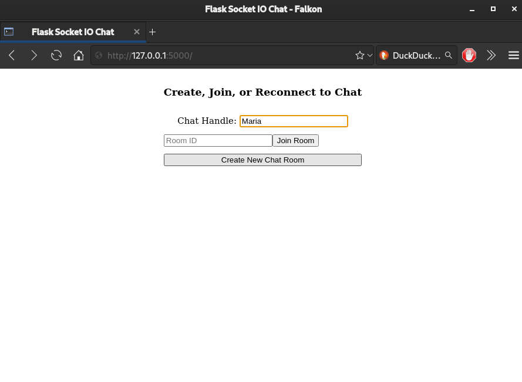
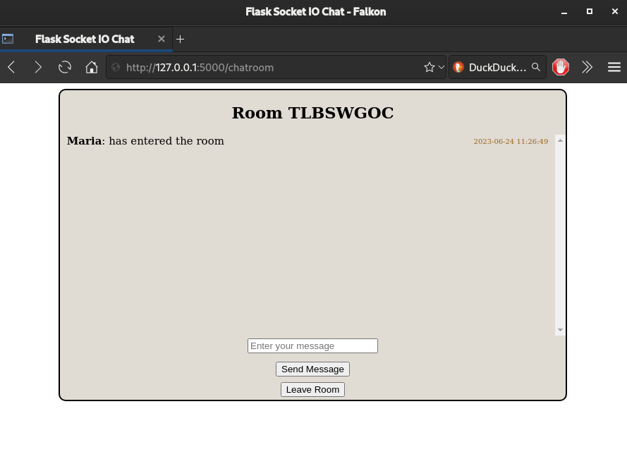
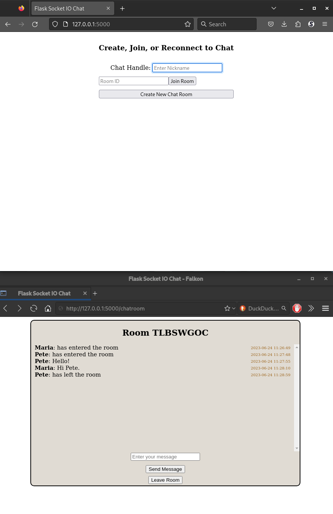

# <Live-Chat-Flask>

## Description

This project was created to experiment with a light real time chat program which works in a browser using Flask. The SocketIO protocol appeared as a great option after a little investigation and the direction I decided to pursue. There are numerous implementations of the SocketIO protocol and I chose to use the flask-socketio package which provides "low latency bi-directional communications between the clients and the server." Exactly what I want! Additionally, by using the SocketIO protocol, clients have already been  implemented in Python, JavaScript, Swift, Java, C++, and as long as the SocketIO client protocol is implemented a client can be built for a huge array of platforms.

A feature I found attractive about SocketIO besides the low latency event based messaging was the ability to message to groups of users by rooms. This fit into the "chat room" concept very neatly and made SocketIO the clear choice. I was easy to find a good guide fitting the concept from [Tech With Tim's](https://www.youtube.com/@TechWithTim) [Python Live Chat Room Tutorial Using Flask & SocketIO](https://www.youtube.com/watch?v=mkXdvs8H7TA). I used the tutorial as a starting point and have extended it slightly. I added a Leave Room button and server side timestamp generation which is stored with the messages as they're sent. I decided this would be a good simple project to build out a more involved GitHub README setup guide for after getting the project up and running.

Some additional features for the future would be the addition for the user to name the chatrooms, perhaps giving different colors to each user name or some other way to make them easier to distinguish when talking in a room, and adding a database to store messages in a persistant way. Also, I am not sold on the message log storage implementaton and think that I would modify it to display a fixed amount of previous messages upon joining a room to limit server load, storage size, and latency to the user.

## Table of Contents

- [Installation](#installation)
- [Usage](#usage)
- [Credits](#credits)
- [License](#license)

## Installation

The project was build and tested in Fedora Linux using FireFox and Falkon as chat clients to check function on both the Gecko and QtWebKit browser engines. It should work in Chrome as well, since QtWebKit is based on Chromium's web engine.

 Python verion 3.11.3 and pip version 23.1.2 were used to develop this project. To install once these prerequisites are installed:

- Navigate to the project directory in a terminal 
- Run `pip install -r requirements.txt` in the working directory of this project (or your virtual environment for the project)
- pip will install Flask and flask-socketio (Flask==2.3.2 & flask-socketio==5.3.4)

- run the project with `python main.py`
- if this step fails try `python3 main.py`

- The development server runs by default to http://127.0.0.1:5000 and can be stopped with CTRL+C.

## Usage

- To use the project locally, go to the default URL:port. If you are using only one browser, you will need to open on client in private mode (so the server views your sessions as different users).

- There is a default Flask secret key that should be changed if this project is going to be used on a public server.

- Currently room names are randomly generated and are all capital letters.

- Open the browser and go to the appropriate URL.

   

- Enter your desired chat name, then click **Create New Chat Room**
 
   

- When a user joins a room there is a broadcast timestamp to all room users. The room code is at the top.
In the example it is **TLBSWGOC**

   

- Other users can join the existing rooms if they have the room code by entering their handle and the code into
the appropriate spaces and then clicking **Join Room**. All previous messages in the room will be displayed for them (but not previous user join/disconnection messages). 

   

- The users can now chat by typing their messages and clicking **Send Message**. Messages will get a time stamp and
be stored by the server per room. They are not stored in a database so they are lost if the server is shut down. A user's joining and leaving timestamps are not saved.

   

- By clicking **Leave Room** a user can exit the room and go back to the landing screen. The disconnection timestamp
takes about 40 seconds to broadcast to the room.

   

- Users can rejoin chatrooms in the same way they joined before. All previous messages are displayed when they rejoin.

   

- Users can have multiple rooms at once. Messages are stored per room. 

- When there are no more users in the room, it is deleted from the server and the messages are also removed.

- When you are done, the server can be stopped with `CTRL+C` in the terminal.

## Credits

I followed [Tech With Tim's](https://www.youtube.com/@TechWithTim) [Python Live Chat Room Tutorial Using Flask & SocketIO](https://www.youtube.com/watch?v=mkXdvs8H7TA) tutorial for this project. 

I extended it a bit beyond the tutorial, adding server based time stamps and a "leave room" button. I think further extending it to allow users do have different chat room colors and name colors and selecting room codes would be a good next step. Additonally, hooking up a database to store messages and perhaps only indexing a fixed amount of messages when a user joins would be another worthwhile improvement.

[Flask-SocketIO's documentation](https://flask-socketio.readthedocs.io/en/latest/intro.html) was very helpful in getting a grasp with how messages are emitted and broadcast, how rooms are constructed, and other tips. 

## License

Licensed under the [MIT](LICENSE) license.

